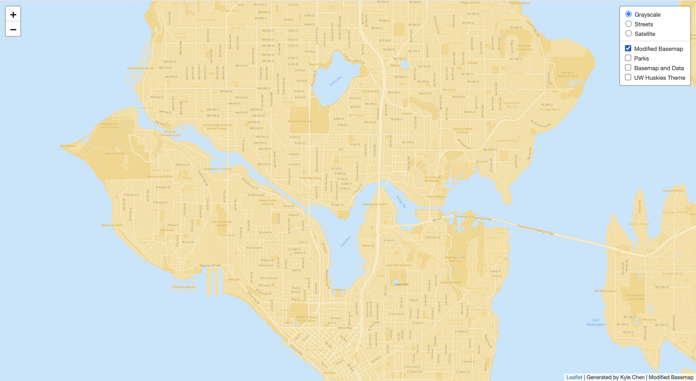
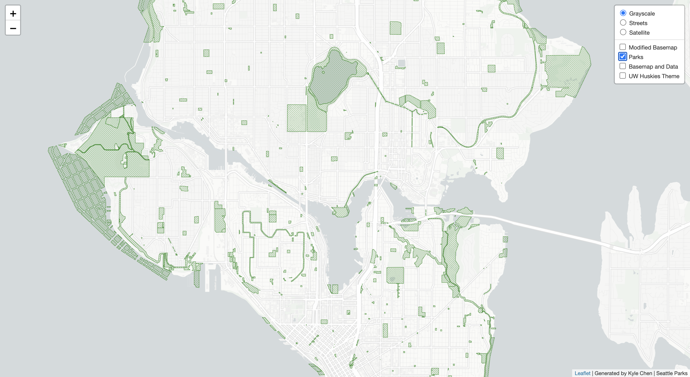
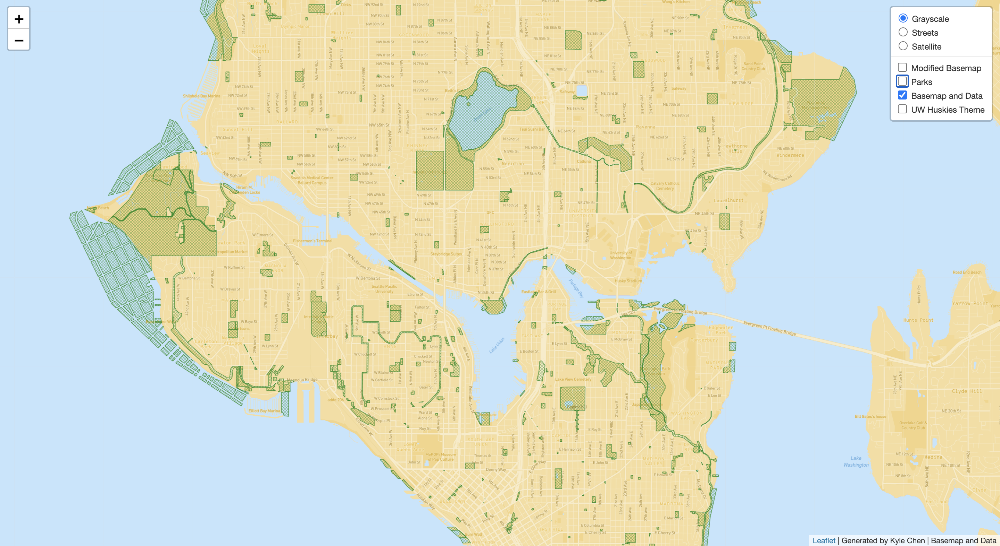
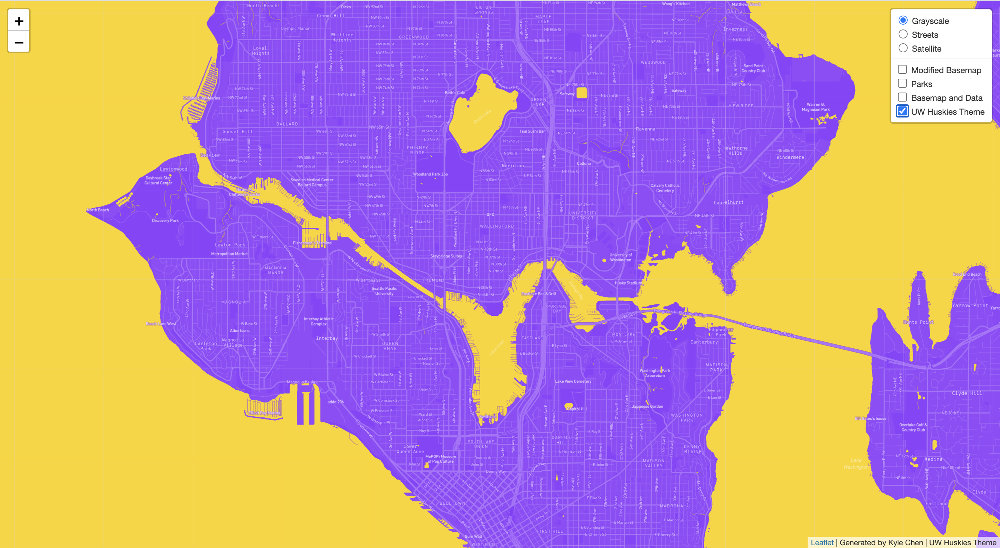

# Lab 4: Map Design and Tile Generation
Link to hosted webmap: https://kyle0828.github.io/mapDesign/

## Tile 1 Screenshot - Modified Basemap

- Description of Tile: Modified basemap showing North Seattle area. The font of major cities and color of water have been changed.
- Geographic Area of Focus: (North) Seattle, WA
- Zoom Levels: Max Zoom - 14; Min Zoom - 12

## Tile 2 Screenshot - Map Data (Parks and Recreation, Seattle)

- Description of Tile: Data layer showing the location of parks and recreation in Seattle, WA.
Data was downloaded from: [data.seattle.gov](https://data.seattle.gov/Parks-and-Recreation/Seattle-Parks-and-Recreation-GIS-Map-Layer-Shapefi/ptpk-refv/data)
- Geographic Area of Focus: (North) Seattle, WA
- Zoom Levels: Max Zoom - 14; Min Zoom - 12

## Tile 3 Screenshot - Basemap and Data

- Description of Tile: Tile utilizing the modified basemap from Tile 1 & the map data from Tile 2
- Geographic Area of Focus: (North) Seattle, WA
- Zoom Levels: Max Zoom - 14; Min Zoom - 12

## Tile 4 Screenshot - UW Huskies Theme

- Description of Tile: Map tile made using the color scheme from the University of Washington.
- Geographic Area of Focus: (North) Seattle, WA
- Zoom Levels: Max Zoom - 14; Min Zoom - 12
